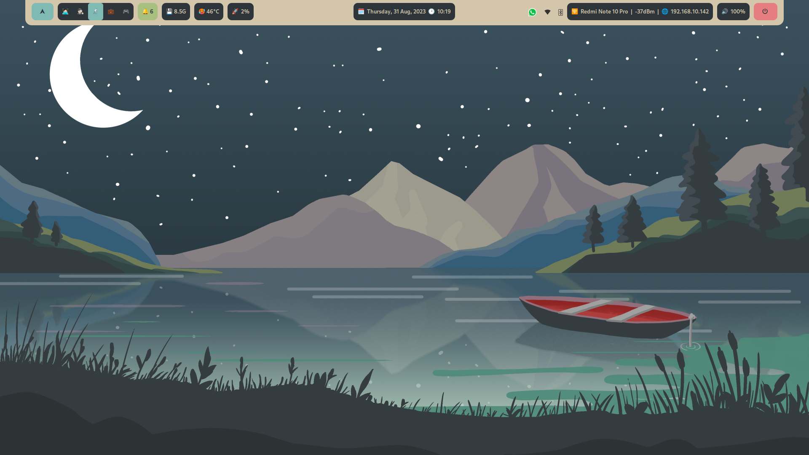

# summer-night
Hyprland rice for the summer themed competition. Wallpapers & Repository are made by [MathisP75](https://github.com/MathisP75), This fork intended for enhanced functionality.

## Themes: 
* GTK: [Everforest-Light-BL/Everforest-Dark-BL](https://www.gnome-look.org/p/1695467)
* Icons: [Ubuntu/Yaru-Blue-Dark](https://www.gnome-look.org/p/1299514)
* Cursors: [ful1e5/Bibata-Modern-Classic](https://www.gnome-look.org/p/1914825)
* Font: Ubuntu

## Installation:

### Intel

```
./intel.sh
```

### Amd

```
./amd.sh
```

### Nvidia

```
./nvidia.sh
```

## Programs:
* Bar: Waybar
* Launcher: Rofi
* Terminal: Kitty
* File manager: Nemo

## Features
* VA/VDPAU ✅
* OpenGL/Vulkan ✅
* QT/GTK3/GTK4 ✅

## TODO:
* Wofi Screenshots Key (like gnome screenshot resize)
* Dunst Notification Design & Functionality
* Integrating Waybar modules **network** with `network-manager-applet`
* Integrating Waybar modules **bluetooth** with `blueman`

## Screenshots:

***